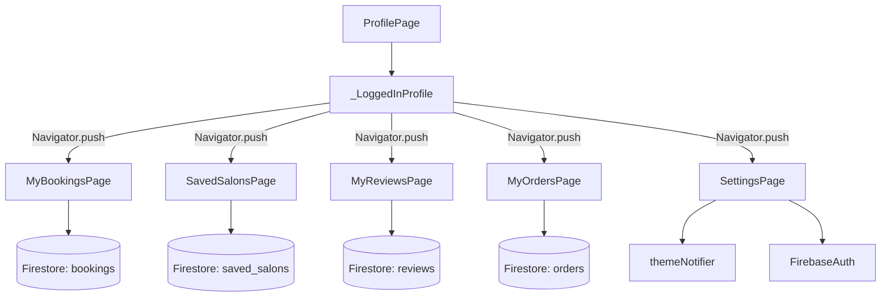

# Design Document: Profile Sub-Pages

## Overview

This feature adds five navigable sub-pages to the StyleNow Flutter app's Profile tab: My Bookings, Saved Salons, My Reviews, My Orders, and Settings. Each page is reachable by tapping the corresponding tile in `_LoggedInProfile` on `profile_page.dart`. All pages stream live data from Firebase Firestore filtered by the current user's UID, and follow the app's existing visual language (AppColors, AppTheme, card style).

The Settings page is distinct — it manages app-level preferences (dark mode via `themeNotifier`) and account actions (change password via Firebase Auth).

## Architecture

The feature follows the existing pattern in the codebase: stateful Flutter widgets that own their Firestore `StreamBuilder` directly, with no additional state management layer. This keeps each page self-contained and consistent with how the rest of the app is structured.



Each data page uses a `StreamBuilder<QuerySnapshot>` to react to real-time Firestore updates. The Settings page uses a `ValueListenableBuilder` over `themeNotifier` for the dark mode toggle.

## Components and Interfaces

### Navigation wiring — `profile_page.dart`

The five empty `() {}` callbacks in `_LoggedInProfileState._tile()` calls are replaced with `Navigator.push` calls:

```dart
_tile(context, Icons.calendar_today_outlined, 'My Bookings', textColor,
    () => Navigator.push(context, MaterialPageRoute(builder: (_) => const MyBookingsPage()))),
_tile(context, Icons.favorite_outline, 'Saved Salons', textColor,
    () => Navigator.push(context, MaterialPageRoute(builder: (_) => const SavedSalonsPage()))),
_tile(context, Icons.star_outline, 'My Reviews', textColor,
    () => Navigator.push(context, MaterialPageRoute(builder: (_) => const MyReviewsPage()))),
_tile(context, Icons.shopping_bag_outlined, 'My Orders', textColor,
    () => Navigator.push(context, MaterialPageRoute(builder: (_) => const MyOrdersPage()))),
_tile(context, Icons.settings_outlined, 'Settings', textColor,
    () => Navigator.push(context, MaterialPageRoute(builder: (_) => const SettingsPage()))),
```

### Shared `_SubPageScaffold` helper

A thin internal widget used by all five pages to enforce consistent AppBar styling:

```dart
// Provides AppBar with back button + title, wraps body in Scaffold
class _SubPageScaffold extends StatelessWidget {
  final String title;
  final Widget body;
}
```

### Shared `_StatusChip` widget

Used by My Bookings and My Orders to render coloured status labels:

```dart
// Maps status string → background colour, renders a rounded chip
class _StatusChip extends StatelessWidget {
  final String status;
}
```

### Data pages (My Bookings, Saved Salons, My Reviews, My Orders)

Each follows the same structure:

```
StatelessWidget
  └── _SubPageScaffold
        └── StreamBuilder<QuerySnapshot>
              ├── loading → CircularProgressIndicator
              ├── error   → error message Text
              ├── empty   → empty state Column (icon + message)
              └── data    → ListView.builder of _*Card widgets
```

### `MyBookingsPage` — `lib/screens/profile/my_bookings_page.dart`

- Stream: `bookings` where `userId == uid`
- Card fields: salonName, serviceName, date, time, `_StatusChip(status)`

### `SavedSalonsPage` — `lib/screens/profile/saved_salons_page.dart`

- Stream: `saved_salons` where `userId == uid`
- Card fields: salonName, `Image.network(imageUrl)`, star rating row

### `MyReviewsPage` — `lib/screens/profile/my_reviews_page.dart`

- Stream: `reviews` where `userId == uid`
- Card fields: salonName, star rating row, comment, date

### `MyOrdersPage` — `lib/screens/profile/my_orders_page.dart`

- Stream: `orders` where `userId == uid`
- Card fields: productName, date, total (formatted), `_StatusChip(status)`

### `SettingsPage` — `lib/screens/profile/settings_page.dart`

- Dark mode: `ValueListenableBuilder` over `themeNotifier` from `main.dart`; `Switch` writes back to `themeNotifier.value`
- Account info: reads `FirebaseAuth.instance.currentUser` for displayName and email, displayed as read-only `ListTile`s
- Change password: calls `FirebaseAuth.instance.sendPasswordResetEmail(email: email)`, shows `SnackBar` on success/failure
- Change password button only shown when `user.providerData` contains an email/password provider

## Data Models

All data is read directly from Firestore `QueryDocumentSnapshot` maps — no separate model classes are introduced, keeping the implementation minimal.

### Booking document (`bookings` collection)

| Field | Type | Notes |
|---|---|---|
| userId | String | Firestore query filter |
| salonName | String | Displayed on card |
| serviceName | String | Displayed on card |
| date | String | Displayed on card |
| time | String | Displayed on card |
| status | String | e.g. "confirmed", "completed", "cancelled" |

### Saved Salon document (`saved_salons` collection)

| Field | Type | Notes |
|---|---|---|
| userId | String | Firestore query filter |
| salonName | String | Displayed on card |
| imageUrl | String | Loaded via `Image.network` |
| rating | num | Rendered as star row |

### Review document (`reviews` collection)

| Field | Type | Notes |
|---|---|---|
| userId | String | Firestore query filter |
| salonName | String | Displayed on card |
| rating | num | Rendered as star row (1–5) |
| comment | String | Displayed on card |
| date | String | Displayed on card |

### Order document (`orders` collection)

| Field | Type | Notes |
|---|---|---|
| userId | String | Firestore query filter |
| productName | String | Displayed on card |
| date | String | Displayed on card |
| total | num | Formatted as currency string |
| status | String | e.g. "processing", "shipped", "delivered" |

